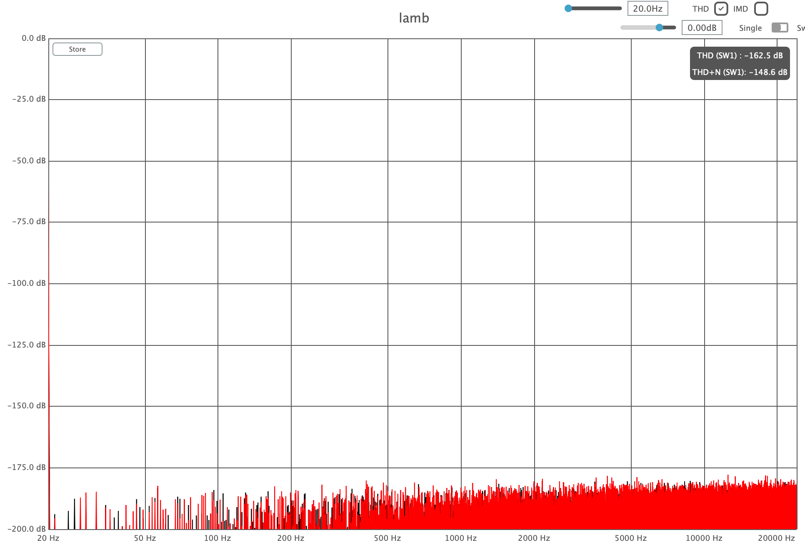

# lamb 🐑

A lookahead compressor/limiter that's soft as a lamb. 

There is also a version with a Rust GUI, latency compensation and proper scaling of the parameters:
https://github.com/magnetophon/lamb-rs

Lamb was made with these goals in mind:
- Be as clean as possible
- Give the user full control over the character with the minimum amount of knobs.

The secret sauce is all in the attack/release:
you can change both the length and the shape of their curve.  
The shapes look like [this](https://www.desmos.com/calculator/iuvx0mrsyi); _t_ in Desmos corresponds to the _shape_ parameter in the plugin.  
When it has the middle value, the curve is a slice of pure sine.  

With the default settings, there is practically zero distortion, even at 20Hz:

    

## user preferences

The start of the dsp file has a few user changeable values:
- MaxSampleRate  
  **ATTENTION** If you want to use the plugin with a samplerate of more than 192k, make sure you change this.  
- NrChannels  
  Speaks for itself.
- testingFeatures  
  0 for a simple plugin.  
  1 for gain reduction outputs, an A/B comparison system and a comparison to a 4-pole smoother.

🐑
